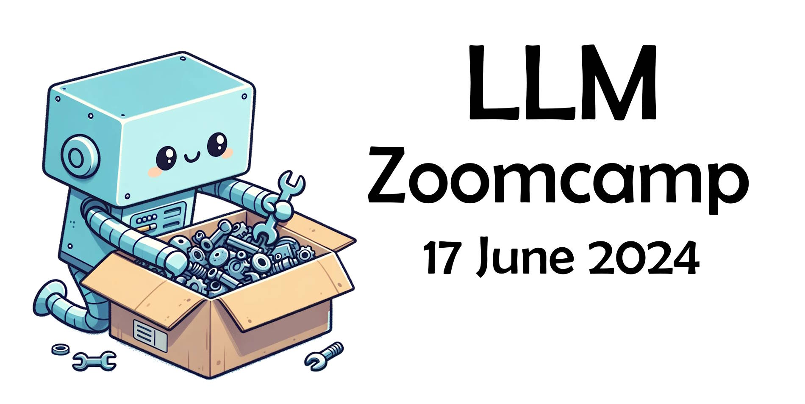

# LLM Zoomcamp 

  

LLM Zoomcamp - a free online course about real-life applications of LLMs. From Data Talks, the actual repo is on [HERE](https://github.com/DataTalksClub/llm-zoomcamp/tree/main)
knowledge base.

Pre-requisites:

* Comfortable with programming and Python
* Comfortable with command line
* Docker
* No previous exposure to AI or ML is required

## Syllabus

### Pre-course workshops

Introduction

* build a simple Q&A system 
* Video: https://www.youtube.com/watch?v=q-p36Ak6YI8
* Code: https://github.com/alexeygrigorev/llm-rag-workshop

Implement a search engine

* Video: https://www.youtube.com/watch?v=nMrGK5QgPVE
* Code: https://github.com/alexeygrigorev/build-your-own-search-engine

### [Introduction to LLMs and RAG](01-intro/)

* LLMs and RAG
* Preparing the environment 
* Retrieval and the basics of search

### [Open-source LLMs and self-hosting LLMs](02-open-source/)

* Simple RAG with Open-Source LLMs

### [Vector databases and retrieval techniques](03-vector-search/)

* Embeddings
* Vector search
* Adding vectors to RAG

### [Workshop: dlt](cohorts/2024/workshops/dlt.md)

### [LLM orchestration and ingestion pipelines](04-orchestration/)

* Ingesting data with Mage

### [Monitoring and Guardrails](05-monitoring/)

* Monitoring with ground-truth
* Metrics (RAGAs)
* Dashboarding with Grafana for visualization
* Monitoring chat
* Guardrails

## Instructors

- [Alexey Grigorev](https://linkedin.com/in/agrigorev/)
- [Magdalena Kuhn](https://www.linkedin.com/in/magdalenakuhn/)

Do you want to support our course and our community? Please reach out to [alexey@datatalks.club](alexey@datatalks.club)
